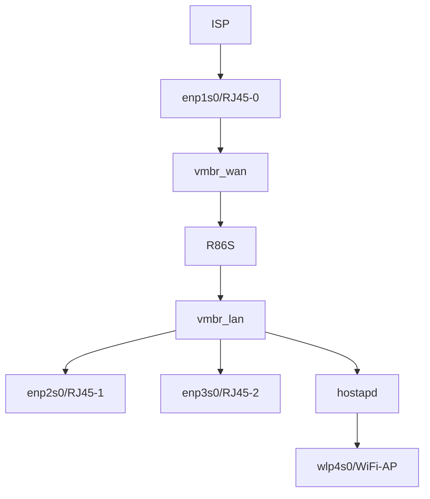
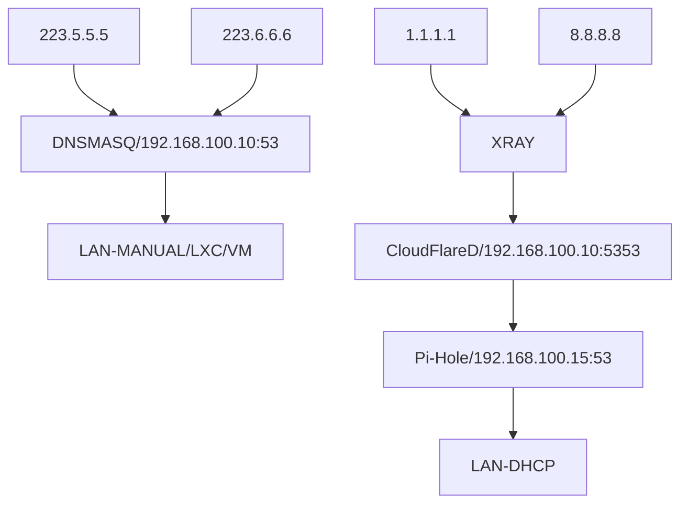

> R86S - IaaS

# Hardware

- R86S
- MT7925

Wiring



DNS Flow



# Software

## Routing

### 1. Install

- Install debian 12
- APT source

```shell
curl -sSL https://enterprise.proxmox.com/debian/proxmox-release-bookworm.gpg -O /etc/apt/trusted.gpg.d/proxmox-release-bookworm.gpg

cat << EOF > /etc/apt/sources.list
deb https://mirrors.tuna.tsinghua.edu.cn/debian/ bookworm main contrib non-free non-free-firmware
deb https://mirrors.tuna.tsinghua.edu.cn/debian/ bookworm-updates main contrib non-free non-free-firmware
deb https://mirrors.tuna.tsinghua.edu.cn/debian/ bookworm-backports main contrib non-free non-free-firmware
deb https://mirrors.tuna.tsinghua.edu.cn/debian-security bookworm-security main contrib non-free non-free-firmware
deb https://mirrors.tuna.tsinghua.edu.cn/proxmox/debian/pve bookworm pve-no-subscription
EOF
```

- Install packages

```shell
apt update && apt install vim htop bmon lrzsz chrony iptable-persist postfix open-iscsi bridge-utils
```

- Replace kernel

```shell
apt install proxmox-default-kernel
systemctl reboot
```

- Remove old kernel

```shell
apt remove linux-image-amd64 'linux-image-6.1*'
apt remove os-prober
update-grub
```

### 2. Append hosts

```text
::1                 localhost
127.0.0.1           localhost

192.168.100.10      server ← Your hostname here
```

```shell
hostname --ip-address
```

### 3. Networking

- Config interfaces

```text
auto lo

iface lo inet loopback

auto enp1s0
auto enp2s0
auto enp3s0

iface enp1s0 inet manual
iface enp2s0 inet manual
iface enp3s0 inet manual

auto vmbr_wan
auto vmbr_lan

iface vmbr_wan inet dhcp
	bridge_fd 0
	bridge_stp off
	bridge_waitport 0
	bridge-ports enp1s0

iface vmbr_lan inet static
	bridge_fd 0
	bridge_stp off
	bridge_waitport 0
	bridge-ports enp2s0 enp3s0
	address 192.168.100.10/24
```

- Restart networking or Reboot
- Config iptables for NAT

```shell
iptables -t nat -A POSTROUTING -j ACCEPT -m policy --dir out --pol ipsec
iptables -t nat -A POSTROUTING -j MASQUERADE -o vmbr_wan
iptables-save > /etc/iptables/rules.v4
```

### 4. Time sync

Add allow to `/etc/chrony/chrony.conf`

```text
allow 192.168.100.0/16
```

### 5. DNSMASQ

Modify `/etc/dnsmasq.conf`

```text
listen-address=192.168.100.10
no-poll
no-resolv
server=223.5.5.5
server=223.6.6.6
interface=vmbr_lan
dhcp-authoritative
dhcp-range=192.168.100.201,192.168.100.249,12h
dhcp-option=option:router,192.168.100.10
dhcp-option=option:ntp-server,192.168.100.10
dhcp-option=option:dns-server,192.168.100.15
```

#### Static Lease

There are two ways. First one is recommended

##### 1. Argument / Configuration

Append to `/etc/dnsmasq.conf`

```text
dhcp-host=servername,192.168.0.199
dhcp-host=00:20:e0:3b:13:af,servername,infinite
dhcp-host=aa:bb:cc:dd:ee:ff,192.168.0.199
```

##### 2. Modify leases file

Leases file `/var/lib/misc/dnsmasq.leases`

```text
1741103411 00:f0:cb:aa:bb:23 192.168.100.230 hostname aa:aa:aa:aa:aa:aa:aa:aa:aa:aa:aa:aa:aa:aa
1741103713 12:5a:27:aa:bb:79 192.168.100.242 hostname aa:aa:aa:aa:aa:aa:aa
1741102288 26:3d:2b:aa:bb:0c 192.168.100.209 hostname aa:aa:aa:aa:aa:aa:aa
1741102279 00:e0:4c:aa:bb:1a 192.168.100.250 hostname aa:aa:aa:aa:aa:aa:aa
1741102346 92:e6:81:aa:bb:44 192.168.100.228 hostname aa:aa:aa:aa:aa:aa:aa
```

### 6. WiFi AP

```shell
cat << EOF > /etc/systemd/system/hostapd.service
[Unit]
After=network.target nss-lookup.target
[Service]
User=root
ExecStart=/opt/hostapd/hostapd -ddd /opt/hostapd/conf/master6.conf
Restart=on-failure
RestartPreventExitStatus=23
LimitNPROC=10000
LimitNOFILE=10000000
[Install]
WantedBy=multi-user.target
EOF

```

#### MT7925 WiFi6 demo

```text
#===============================================================================
ctrl_interface=/var/run/hostapd
ctrl_interface_group=0
driver=nl80211
#===============================================================================
bridge=vmbr_lan
interface=wlp4s0
#===============================================================================
ssid=MT7925-AX
wpa_passphrase=00000000
ignore_broadcast_ssid=0
macaddr_acl=0
auth_algs=3
okc=1
wpa=3
wpa_pairwise=CCMP CCMP-256
rsn_pairwise=CCMP CCMP-256
wpa_key_mgmt=WPA-PSK WPA-PSK-SHA256 SAE
# PMF enabled: ieee80211w=1 and wpa_key_mgmt=WPA-EAP WPA-EAP-SHA256
# PMF required: ieee80211w=2 and wpa_key_mgmt=WPA-EAP-SHA256
# WPA3-Personal-only mode: ieee80211w=2 and wpa_key_mgmt=SAE
ieee80211w=1
sae_require_mfp=1
#===============================================================================
country_code=RU
country3=0x49
ieee80211d=0
ieee80211h=0
#===============================================================================
hw_mode=a
channel=36
#===============================================================================
ieee80211n=1
ht_capab=[LDPC][SHORT-GI-20][SHORT-GI-40][HT40-][HT40+][TX-STBC][RX-STBC1][MAX-AMSDU-7935]
#===============================================================================
ieee80211ac=1
vht_oper_chwidth=2
vht_oper_centr_freq_seg0_idx=50
vht_capab=[MAX-MPDU-11454][RXLDPC][SHORT-GI-80][SHORT-GI-160][TX-STBC-2BY1][SU-BEAMFORMEE][RX-ANTENNA-PATTERN][TX-ANTENNA-PATTERN][VHT80][VHT160]
#===============================================================================
ieee80211ax=1
he_oper_chwidth=2
he_oper_centr_freq_seg0_idx=50
#===============================================================================
```

#### MT7925 WiFi7 demo (FixMe: This Not working even open security)

```text
#===============================================================================
ctrl_interface=/var/run/hostapd
ctrl_interface_group=0
driver=nl80211
#===============================================================================
bridge=vmbr-lan
interface=wlp4s0
#===============================================================================
ssid=MT7925-BE
#wpa_passphrase=00000000
ignore_broadcast_ssid=0
#macaddr_acl=0
#auth_algs=0
#okc=1
#wpa=3
#wpa_pairwise=CCMP CCMP-256
#rsn_pairwise=CCMP CCMP-256
#wpa_key_mgmt=WPA-EAP WPA-EAP-SHA256 SAE
# PMF enabled: ieee80211w=1 and wpa_key_mgmt=WPA-EAP WPA-EAP-SHA256
# PMF required: ieee80211w=2 and wpa_key_mgmt=WPA-EAP-SHA256
# WPA3-Personal-only mode: ieee80211w=2 and wpa_key_mgmt=SAE
# ieee80211w=1
# sae_require_mfp=1
#===============================================================================
country_code=RU
country3=0x49
ieee80211d=0
ieee80211h=0
#===============================================================================
hw_mode=a
channel=36
#===============================================================================
ieee80211n=1
ht_capab=[LDPC][SHORT-GI-20][SHORT-GI-40][HT40-][HT40+][TX-STBC][RX-STBC1][MAX-AMSDU-7935]
#===============================================================================
ieee80211ac=1
vht_oper_chwidth=2
vht_oper_centr_freq_seg0_idx=50
vht_capab=[MAX-MPDU-11454][RXLDPC][SHORT-GI-80][SHORT-GI-160][TX-STBC-2BY1][SU-BEAMFORMEE][RX-ANTENNA-PATTERN][TX-ANTENNA-PATTERN][VHT80][VHT160]
#===============================================================================
ieee80211ax=1
he_oper_chwidth=2
he_oper_centr_freq_seg0_idx=50
#===============================================================================
ieee80211be=1
eht_oper_chwidth=2
eht_oper_centr_freq_seg0_idx=50
eht_su_beamformer=1
eht_su_beamformee=1
eht_mu_beamformer=1
#===============================================================================
```

## Servicing

### 1. StrongSwan VPN

Modify `/etc/ipsec.conf`

```text
conn infra01
	auto = start
	type = tunnel
	authby = secret
	leftid = XXXXXXXX
	rightid = XXXXXXXX
	leftsubnet = 192.168.100.0/24
	rightsubnet = 192.168.1.0/24
	right = example.com
	keyexchange = ikev1
	ike = aes256-sha1-modp768
	esp = aes256-sha1
```

Modify `/etc/ipsec.secret`

```text
: PSK XXXXXXXXXXXXXXXXXXXXXXXXXXXXXXX
```

### 2. XRay

```shell
cat << EOF >  /etc/systemd/system/xray.service
[Unit]
After=network.target nss-lookup.target
[Service]
User=root
ExecStart=/opt/xray/xray run -config /opt/xray/config.json
Restart=on-failure
RestartPreventExitStatus=23
LimitNPROC=10000
LimitNOFILE=1000000
[Install]
WantedBy=multi-user.target
EOF
```

### 3. Cloudflare DoH

```shell
cat << EOF > /etc/systemd/system/cloudflared.service
[Unit]
After=network.target nss-lookup.target xray.service
[Service]
User=root
Environment="HTTP_PROXY=http://127.0.0.1:10810"
Environment="HTTPS_PROXY=http://127.0.0.1:10810"
ExecStart=/opt/cloudflared/cloudflared-linux-amd64 proxy-dns --address 0.0.0.0 --upstream https://1.1.1.1/dns-query --upstream https://8.8.8.8/dns-query --port 30053
Restart=on-failure
RestartPreventExitStatus=23
LimitNPROC=10000
LimitNOFILE=1000000
[Install]
WantedBy=multi-user.target
EOF

```

## Proxmox

### 1. Install

```shell
apt install proxmox-ve
```

Use mirror

```shell
cp /usr/share/perl5/PVE/APLInfo.pm /usr/share/perl5/PVE/APLInfo.pm_back
sed -i 's|http://download.proxmox.com|https://mirrors.tuna.tsinghua.edu.cn/proxmox|g' /usr/share/perl5/PVE/APLInfo.pm
```

### 2. Pi-Hole

```shell
export http_proxy=http://192.168.100.10:10810
export https_proxy=http://192.168.100.10:10810
```

```shell
curl -sSL https://install.pi-hole.net | bash
```
